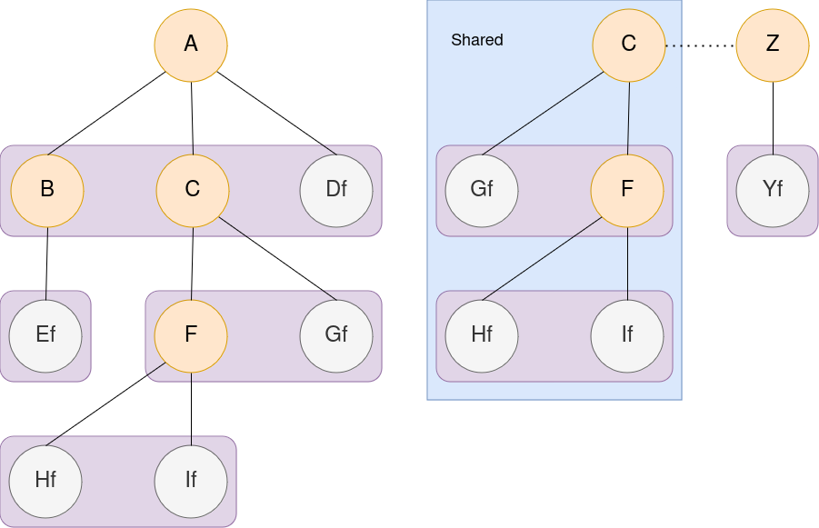

# ICR_shared_fs_simulation
## Author 
```
Alban Favre
```

### Repository location

[Location](https://github.com/alfavre/ICR_shared_fs_simulation)

### Intro

This is a practical rust work for school.
This is done for the 2024 second semester of HES-SO's master ICR course.

### Objectives

Implement a secure file system, that allows file sharing

### Report

This file is **NOT** the report,
the real report can be found in `doc/report_alban_ICR.md` or `doc/report_alban_ICR.pdf`

### Test users

```alban
Alban
4KL7g#.7c,HMPRrZ
```

```zalban
Zalban
a3GoTuAZ
```

### Graph

Alban root is A

Zalban root is Z



### Notes

Everything will be simulated (database, server, communications)

### Help for my poor brain

```rust
    pub fn slice_to_string(slice: &[u8]) -> String {
        String::from(std::str::from_utf8(&slice).unwrap())
    }

    pub fn string_to_slice(string: &str) -> &[u8] {
        // might cause lifetime problems
        string.as_bytes()
    }

    pub fn vec_to_string(vec: Vec<u8>) -> String {
        String::from_utf8(vec).unwrap()
    }

    pub fn vec_to_slice<'a>(vec: Vec<u8>) -> () {
        // might cause lifetime problems
        println!("dont call this method");
        //&vec
    }
```
