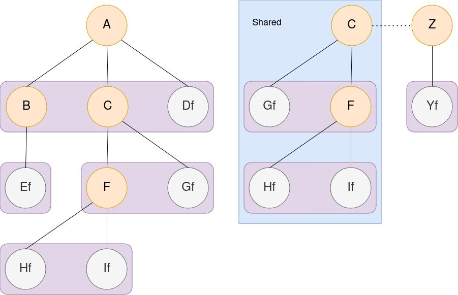

# Report mini project ICR: Encrypted File System

## Author

```
Alban Favre
```

## Test File system

For my implementation I used a test file system, it is the one given with the code, you can see it in the graph below. An orange node is a folder, a gray node is a file (also files have a little f).

We have two user: 

- Alban, which root folder is A, nobody shared fodlers with him.
- Zalban, which root folder is Z, Alban has shared his folder C with Zalban




## Key Management (User/Client)

Each user only needs to know:

1. Their unique username (server has more than one user)
2. Their passphrase (sometimes referred as the master password in the document and code)

However from this passphrase, multiple key are derived, each with different uses:

### Master key (**symmetric xsalsa20poly1305 key**)

At login, the client will derive the **master key** from the passphrase. It is used to:

1. Decrypt and encrypt the user's root folder name and the user's root **folder key** 
2. Derive the client **public key** and **secret key**

### Public and Secret key (asymmetric curve25519xsalsa20poly1305) 

At login, the client will derive the **key pair** from the **master key**. It is used to:

1. Answer the connection challenge from the server. (Needs client **secret key** to decrypt and server **public key** to authenticate)
2. Encrypt the user's folder names and the **folder keys** the user wants to send to another user. (Needs the receiver's **public key** to encrypt and the sender's **secret key** to authenticate).
3. Decrypt the folder names and the **folder keys** that are shared with the user. (Needs the receiver's **secret key** to decrypt and the sender's **public key** to authenticate)

### Folder keys (**symmetric xsalsa20poly1305 key**)

The folder key is used to:

1. Decrypt and encrypt:
   1.  The contained Folder names
   1.  The contained File names
   1.  The contained files Data
   1.  The children **folder keys** 

#### Example: The A folder key encrypts and decrypts:

- The folder name **B** and **C**.
- The file name **Df**.
- The file data **Df**.
- The **B and C folder key**.

## Key management (Server)

### Public and Secret key (asymmetric curve25519xsalsa20poly1305) 

The server needs a **public and secret key** to:

1. Encrypt the connection challenge. (Needs the **client public key** to encrypt and their **secret key** for authentication).

## Security Requirements

Important: At no time and no circumstances should the server ever be aware of:

- Any plain text filenames
- Any plain text files
- The master password
- The master key
- Any folder keys
- Any Secret keys

However, the server might now:

- The folder structure and Size
- All usernames (assumed unique)

## Structure

### There are 4 entities:

- The user which knows the master password and username
- The client, an app that will do all the work with the master password, it does the computation for the user.
- The server, the app that makes the link between the vault and the client
- The vault, The database that stores all metadata and encrypted files and fodlers.

### There are 3 types of things that are stored:

- **The user metadata**, one per user, it contains:
  - The user name, this is not encrypted, is the metadata's primary key.
  - the hash of the encrypted folder name, this is used as the ID of the root folder
  - the encrypted root folder name
  - multiple vectors of shared folder stuff:
    - shared folder owners, this is not encrypted, used to get the owner public key
    - encrypted shared folder names (asymmetric)
    - encrypted shared **folder keys** (asymmetric (but the encrypted key is still a symmetric key))
    - the hash of the shared folder name, this is not encrypted, this is used as the ID of the shared folder
  - the master salt used to derive the **master key**
  - the root name nonce, used to decrypt the root folder name
  - the **public key** used only for other to do asymmetric encryption with the user
  
- **Encrypted folders**, 1 to many per user, it contains:
  - the hash of the encrypted folder name, this is used as the ID of the folder
  
  - the owner name, used only to print the file name as `owner:filename`
  
  - a `shared` flag, not implemented, was going to be used to let the owner know if his folder is shared
  
  - the encrypted folder key, needed to decrypt the folders file and folder names, data and child **folder keys**
  
  - The encrypted file and folder names
  
  - The hash of the encrypted files and folders names, used as the ID of the files and folders
  
  - the nonces used to decrypt the file and folder names
  
  - the nonce to decrypt the **folder key**.
  
- **Encrypted files**, 0 to many per user, it contains:
  - a hash of the encrypted file name, used as an ID of the file
  - a hash of the owner name, unused
  - the encrypted file data
  - the nonce to decrypt the file data

*All the stored structure can be found in src/file_n_metadata.rs*

## Fake Database

To simulate the database, I use three files: `coolfilevault.txt`, `coolfoldervault.txt` and `coolmetadatavault.txt` . Those three files are supposed to represent three table in the database. I'd like to precise that the method `Vault::create_default_db()` and the tests in `vault.rs` are extremely ugly. These were made in the sole purpose to quickly understand and test my cryptographic designs. They are therefore filled with copy pasted code and hard codded value.

If the database is not initialized, the connection wont work, as there are no user's metadata. The repo comes with a preinitialized fake database.

## Fake connection

There is no communication, 2 objects, a client and a server will simulate the communications.

## Challenge-response authentication

As the server should never see the master password. I could not give it during authentication.

I went with a simple asymmetric approach. All user of my file system would have their public key stored in the server. How did the server get the public key, well it was simply given during the account creation (not implemented in client). The challenge is extremely simple: the server generate a random bstring of 256 bytes (`sodiumoxide::randombytes::randombytes`), encrypts/authenticate it with the client public key and it's secret key. (`sodiumoxide::crypto::box_::curve25519xsalsa20poly1305::seal`). The server then sends to the client:

- the encrypted 256 bstring
- it's public key ( this is an implementation shortcut, in practice the client would already have the public key from a cert)
- the nonce to decrypt
- the client salt (due to the only 1 password rule the client doesn't know its keypair salt, so in this implementation the server sends it here, so that the client can derive it's key pair from the master passphrase)

The client then has to just, derive it's key pair and decrpyt the bstring. When it send the correct bstring back the connection is established and can access its metadata.

### Bullet list challenge response

- the bstring is random, this means we stop replay attacks
- the decrypted bstring is sent to the client in clear -> vulnerable to man in the middle attacks. A real implementation would use end to end encryption (SSL, or similar for ssh).
- Tried to stop side channel attack: If an attacker use the challenge response to see if Dalban is a real user, they would know because the server would not be able to encrypt, as Dalban has no public key. I fixed that by using the server public key in this case, this way the encryption never fails. But, they would still now because of the salt, if the user is not in the DB, I generate a random salt, so if they ask for Dalban twice, they would now they are not in the DB because they got two different salt. To fix this I should implement a salt generation that takes the username as a seed, but I did not have the time to find how to do that. **In the end it's a bit moot as the usernames are not really private in this implementation, an attacker with an account can just get the user list.**

## Choose a root and folder exploration

The **master key** has been derived from the **master password** using `sodiumoxide::crypto::pwhash::scryptsalsa208sha256::derive_key`

The **keypair** has been derived from the **master key** with: `sodiumoxide::crypto::box_::curve25519xsalsa20poly1305::Seed::from_slice` and `sodiumoxide::crypto::box_::curve25519xsalsa20poly1305::keypair_from_seed`

Now that the client has its metadata, it asks if they wants to look at their shared folders, or if they want to jump to their root folder, which name has been decrypted with the **master key** (symmetric decryption). We only ask because the asymmetric decryption can be slow.

### Shared folders

If the user wants to access their shared folder, then all shared folder encrypted names will be decrypted, this can be slow as it is asymmetric decryption. Decryption is done with `sodiumoxide::crypto::box_::curve25519xsalsa20poly1305::open`, which is also authenticated (we need to ask the server for the public key when decrypting).

When the user choose the folder they want to go to, then only the asymmetric encrypted folder key of that particular shared folder will be decrypted.

Once in a shared folder, no more asymmetric operation will be done. The shared folder is now the current root, and will act exactly like the user root, but using the shared **folder key** instead of the root **folder key**

### User Root folder

If instead the user want to see their root (or simply nobody shared a folder with them). Then the root **folder key** will be decrypted with the **master key** using `sodiumoxide::crypto::secretbox::xsalsa20poly1305::open`

The client can decrypt the root folder file name and folder names.

If they want to access a file, they just have to ask.

If they want to go to a child folder they just have to ask, in which case the next **folder key** is decrypted with the previous one.

They also can go back a folder, if the folder they leave is the current root, the application will close.

### Root and exploration bullet points

- I have minimized how much asymmetric decryption is done, but if the user has millions of shared folder, it will take ages to decrypt all folder names. It has not been implemented but a page system can be imagined to fix this problem
- The folder exploration is a recursive loop, if the user has millions of cascading folders, the client will probably struggle to keep everything in memory. This is an implementation issue, and could be made non recursive if I had the time. 
- All file names, folder names, **folder keys** and file data have a unique nonce, stored in the DB for decrypting, this also the case for the asymmetric cases. No nonce is ever reused
- Asymmetric nonces are `box_` and Symmetric nonces are `secretbox`

## Choosing a file or folder

The files in the vault are uniquely defined with a hash of their encrypted name which are used as indexes(`sodiumoxyde::crypto:hash:sha512`). In my implementation all folder and file name come with their hashes, this is just a shortcut, in practice we could compute the hash to know the index.

## Sharing folder

This has not been implemented in the client, client is read only. But it is implemented in the vault (but is dirty).

If a user wants to share a folder, the client has to:

1. Generate an asymmetric nonce for the folder name
2. Generate an asymmetric nonce for the **folder key**
3. Encrypt the folder name and the **folder key** with the corresponding nonces, the receiver public key (it can ask the server for it), and its secret key to authenticate the cypher text
4. Update the owner folder with the `is_currently_shared` flag
5. Update the receiver shared vector (owner, encrypted names, encrypted keys, encrypted names hashes).


```rust
 //=======================================================================================
 //We share folder c from alban to zalban, we need to update zalban too
 //=======================================================================================

        // share c to zalban
        let c_shared_folder_name_nonce = box_::gen_nonce();
        let c_shared_folder_key_nonce = box_::gen_nonce();
        let asym_encrypted_folder_name_c = Vault::help_encrypt_data_asym(
            constant::TEST_NAME_TO_ENCRYPT_C.as_bytes(),
            &c_shared_folder_name_nonce,
            &zalban_public_key,
            &alban_secret_key,
        );
        let asym_encrypted_folder_key_c = Vault::help_encrypt_data_asym(
            my_folder_key_c.as_ref(),
            &c_shared_folder_key_nonce,
            &zalban_public_key,
            &alban_secret_key,
        );
```


## Revoke folder sharing

This has not been implemented in the client nor in the vault (as there you can just undo the sharing).

But here is how I would do it:

1. User realizes they don't want to share a `is_currently_shared` folder
2. The client generate a new **folder key**, for this folder and **all** the child folders and re-encrypt **all files, foldernames, filenames and folder keys**, it then has to also recompute all file and folder names hashes, and update everything.
3. Don't forget to update the `is_currently_shared` flag.
4. Update the other users shared vector (owner, encrypted names, encrypted keys, encrypted names hashes) to remove the not shared anymore folder.
5. The client of the user who used to have access to the shared folder, will simply not have them in their's vector anymore.

## Change passphrase

This has not been implemented in the client but is kinda implemented in the vault (but is really dirty), an example implementation is shown below

This is what the client should do:

1. Get a new **master password**
2. Decrypt all encrypted value in user metadata (to have them accessible)
3. Generate a new salt
4. generate a new **master key** from the new salt and new **master password**
5. generate a new **key pair** from the **master key**
6. makes nonces for the symmetric root folder name and root folder key
7. re encrypt the root folder name and key
8. re compute encrypted root folder name hash
9. generate new asymmetric nonces for all shared folder names and keys
10. Re encrypt shared folder names and shared folder keys, but with **both the client's public and secret key**. We simply cannot access the other user secret key, so we become owner as a quick fix.
11. update user metadata and the root folder only the folder key. Don't forget to change the shared folder owner to **this user**

```rust
//========================================================================================
//update master password
//========================================================================================

        //create the new salt for the users
        let new_salt = pwhash::gen_salt();
        let new_master_key = Self::help_make_key(&new_salt, NEW_PASSPHRASE);

        // make new key pair from new master key
        let new_public_key;
        let new_secret_key;
        let new_box_seed = box_::Seed::from_slice(&new_master_key).unwrap();
        (new_public_key, new_secret_key) = box_::keypair_from_seed(&new_box_seed);


        // making xsalsa key from master key
        let new_key_xsalsa = secretbox::Key::from_slice(&new_master_key).unwrap();

        // making a nonce for the master key
        let new_root_name_nonce = secretbox::gen_nonce();
        let new_root_key_nonce = secretbox::gen_nonce();

        // we encrypt folder name of root only, WITH MASTER KEY
        let root_folder_name_encrypted_a = Self::help_encrypt_data_sym(
            constant::TEST_NAME_TO_ENCRYPT_A.as_bytes(),
            &new_root_name_nonce,
            &new_key_xsalsa,
        );

		//not shown but we get the root folder key from the server, and re encrypt it
		//and update the root folder, only the root key in the root folder needs to be
		//updated

        let encrypted_folder_name_hash_a = Self::help_make_hash(&root_folder_name_encrypted_a);

		// here the shared vector update is pretty fast as alban has 0 shared folders
		// so here is a simulation where alban has 1 shared folder to see the process
		let new_shared_nonce_name = box_::gen_nonce();
        let new_shared_nonce_key = box_::gen_nonce();
        let asym_new_encrypted_folder_name = Vault::help_encrypt_data_asym(
            SHARED_FOLDER_NAME,
            &new_shared_nonce_name,
            &new_public_key,// notice it is now both new's key
            &new_secret_key,
        );
        let asym_new_encrypted_folder_key_c = Vault::help_encrypt_data_asym(
            SHARED_FOLDER_KEY.as_ref(),
            &new_shared_nonce_key,
            &new_public_key,
            &new_secret_key,
        );

        // we update alban metadata
        alban_metadata.encrypted_root_name_hash =
            encode(encrypted_folder_name_hash_a, Variant::UrlSafe);
        alban_metadata.encrypted_root_name = encode(root_folder_name_encrypted_a, Variant::UrlSafe);
        alban_metadata.shared_folder_owner[0] = "Alban" // now alban is owner
            encode(asym_new_encrypted_folder_key_c, Variant::UrlSafe);
        alban_metadata.encrypted_shared_folder_keys[0] =
            encode(asym_new_encrypted_folder_key_c, Variant::UrlSafe);
        alban_metadata.encrypted_shared_folder_names[0] =
            encode(asym_new_encrypted_folder_name, Variant::UrlSafe);
        alban_metadata.master_salt = encode(new_salt, Variant::UrlSafe);
        alban_metadata.root_name_nonce = encode(new_root_name_nonce, Variant::UrlSafe);
        alban_metadata.user_public_key = encode(new_public_key, Variant::UrlSafe);
        


```


## Writing Creating and Deleting file and folder

As the client is read only, we cannot use it to write, add new file/folder or delete a file or folder.

I don't have to the time to implement this in the client, but it will simply work if I did:

- the client has all the tools to do write operations, it is just a question of writing the file, and updating the correct files in the DB (file/fodler name, file/folder encrypted name hash, nonces)
- The only limitation is the root name, either the shared one or the user root, we cannot, under any circumstance edit the root name, as it would absolutely cause problems with the sharing. This also means a user cannot change a folder name if the folder has the "is_currently_shared" flag.